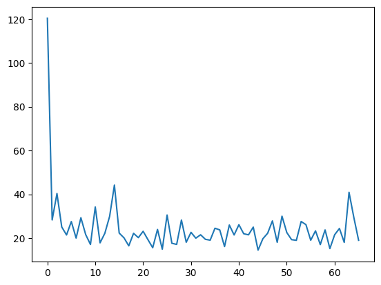
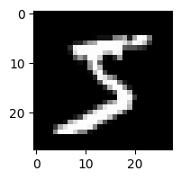
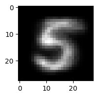

```python
import torch
import torchvision
from torch import nn
import pandas as pd
import numpy as np
import matplotlib.pyplot as plt
```

***
## VARIATIONAL AUTOENCODER
***

(1) https://arxiv.org/pdf/2208.11970.pdf    
(2) https://towardsdatascience.com/understanding-variational-autoencoders-vaes-f70510919f73


This implementation follows the same terminology as in (2)

### *DATASET*

https://www.kaggle.com/datasets/oddrationale/mnist-in-csv


```python
mnist = pd.read_csv("../Data/mnist_train.csv");
```


```python
# 28*28 = 784 -> image
# +1 -> label
mnist.shape
```


    (60000, 785)


```python
# Only take images labeled 5 to speed up the convergence of the model
mnist = mnist[mnist["label"] == 5];
# Remove label column
mnist = mnist.iloc[:,1:];
```


```python
mnist.shape
```


    (5421, 784)


```python
# From Pandas (5421, 784) dataframe to Pytorch (5421,1,28,28) tensor
mnist = torch.tensor(mnist.values).reshape((5421,1,28,28))/255;
```


```python
dataset = torch.utils.data.DataLoader(torch.utils.data.TensorDataset(mnist), batch_size=1, shuffle=True);
```

***
### *MODEL*


**ENCODER**

**INPUT**: RAW IMAGE (1,28,28) -- **OUTPUT**: VECTOR REPRESENTATION OF RAW IMAGE  
h1 = g1 -> 2 CNN layers + 2 Linear layers 

**INPUT**: VECTOR REPRESENTATION OF RAW IMAGE h1 -- **OUTPUT**: MEAN OF THE ENCODER mu_x  
g2 -> 1 Linear layer

**INPUT**: VECTOR REPRESENTATION OF RAW IMAGE h1 -- **OUTPUT**: STANDARD DEVIATION OF THE ENCODER sigma_x  
h2 -> 1 Linear layer


```python
class h1(nn.Module):
    def __init__(self):
        super().__init__();
        self.net = nn.Sequential(
            nn.Conv2d(1, 32, 5), nn.ReLU(), nn.MaxPool2d(2,2),
            nn.Conv2d(32, 64, 3), nn.ReLU(), nn.MaxPool2d(2,2),
            nn.Flatten(),
            nn.Linear(5*5*64, 512), nn.ReLU(),
            nn.Linear(512, 256), nn.ReLU()
        );
        
    def forward(self, raw_image):
        return self.net(raw_image);
```


```python
class h2(nn.Module):
    def __init__(self, latent_dim):
        super().__init__();
        self.linear = nn.Linear(256, latent_dim);
        
    def forward(self, h1):
        return torch.sqrt(self.linear(h1)**2);
```


```python
class g2(nn.Module):
    def __init__(self, latent_dim):
        super().__init__();
        self.linear = nn.Linear(256, latent_dim);
        
    def forward(self, h1):
        return self.linear(h1);
```


```python
class Encoder(nn.Module):
    def __init__(self, latent_dim):
        super().__init__();        
        self.h1 = h1();
        self.h2 = h2(latent_dim);
        self.g2 = g2(latent_dim);
        
        self.mnd = torch.distributions.multivariate_normal.MultivariateNormal(
            torch.zeros(latent_dim), torch.eye(latent_dim));

    def forward(self, raw_image):
        h1 = self.h1(raw_image);
        mu_x = self.g2(h1);
        sigma_x = self.h2(h1);
        
        return mu_x[0], sigma_x[0], mu_x + sigma_x * self.mnd.sample();        
```


```python
enc = Encoder(4);
print(enc(torch.rand(1,1,28,28)))
```

    [W NNPACK.cpp:80] Could not initialize NNPACK! Reason: Unsupported hardware.


    (tensor([ 0.0678,  0.0498,  0.0554, -0.0104], grad_fn=<SelectBackward>), tensor([0.0581, 0.0112, 0.0146, 0.0026], grad_fn=<SelectBackward>), tensor([[ 0.1766,  0.0535,  0.0534, -0.0070]], grad_fn=<AddBackward0>))


**DECODER**


```python
class Decoder(nn.Module):
    def __init__(self, latent_dim):
        super().__init__();        
        self.net = nn.Sequential(
            nn.Linear(latent_dim, 784), nn.LayerNorm(784), nn.Sigmoid()
        );

    def forward(self, z):
        return self.net(z).reshape(1,1,28,28);
```

**ENCODER-DECODER**


```python
class EncoderDecoder(nn.Module):
    """ K is a hyperparameter in the Monte Carlo estimate"""
    def __init__(self, latent_dim, K):
        super().__init__();
        self.K = K;
        self.encoder = Encoder(latent_dim);
        self.decoder = Decoder(latent_dim);
        
    def forward(self, raw_image):
        x_hats = [];
        
        for k in range(self.K):
            mu_x, sigma_x, z = self.encoder(raw_image);
            x_hats.append(self.decoder(z));
        
        return mu_x, sigma_x, torch.cat(x_hats);
```


```python
m = EncoderDecoder(2, 3);
mu, sig, xs = m(torch.rand(1,1,28,28))
```


```python
xs.shape
```


    torch.Size([3, 1, 28, 28])


***
### *TRAINING*

**MODEL**


```python
latent_dim, K = 5, 3;

model = EncoderDecoder(latent_dim, K);
```

**LOSS**


```python
def loss(x, x_hats, mu_x, sigma_x):
    K = len(x_hats);
    
    l1 = 0;
    for x_hat in x_hats:
        l1 += -0.5*torch.nn.functional.mse_loss(x, x_hat, reduction='sum');
    l1 /= K;
    
    l2 = 0.5*(-torch.sum(torch.log(sigma_x**2)+1) + torch.sum(sigma_x**2) + torch.sum(mu_x**2));
    
    return -(l1-l2);
```

**OPTIMIZER**


```python
adam = torch.optim.Adam(model.parameters(), lr=0.1);
```

**TRAIN**


```python
def train(dataset, model, loss, optimizer, num_epochs):
    
    losses = [];
    
    for _ in range(num_epochs):
        for i, raw_image in enumerate(dataset):
            mu_x, sigma_x, x_hats = model(raw_image[0]);
            l = loss(raw_image[0][0], x_hats, mu_x, sigma_x);
            l.backward();
            optimizer.step();
            optimizer.zero_grad();
            
            if i%250 == 0:
                losses.append(l.detach().numpy());
    
    return losses;
```


```python
losses = train(dataset, model, loss, adam, 3);
```


```python
plt.plot(range(len(losses)), losses)
```


    [<matplotlib.lines.Line2D at 0x7f90b2c54670>]


    

    


```python
plt.figure(figsize=(2, 2));
plt.imshow(mnist[0,0], cmap='gray');
```


    

    


```python
plt.figure(figsize=(2, 2));
plt.imshow(model(torch.unsqueeze(mnist[0], dim=0))[2][0][0].detach().numpy(), cmap='gray')
```


    <matplotlib.image.AxesImage at 0x7f90b20536d0>


    

    

